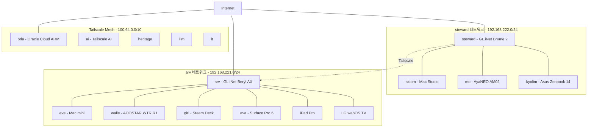

# Dotfiles

macOS, NixOS, SteamOS, Debian, Windows 등 이종 운영체제 환경을 GNU Stow 및 sops 암호화로 일관되게 관리하는 크로스플랫폼 dotfiles 프로젝트입니다. 단일 커맨드로 배포를 자동화하고, 개인 정보 및 시크릿을 안전하게 동기화하며, 전 호스트 공통 도구 및 AI 지침을 관리합니다.

## 목차

- [Documentation (Diátaxis Index)](#documentation-diátaxis-index)
- [Hosts](#hosts)
- [Hardware](#hardware)
- [Network](#network)
- [Application Manager (Library 4-Layer)](#application-manager-library-4-layer)
- [Install](#install)
- [Stow Adopt](#stow-adopt)
- [Structure](#structure)
- [Secrets](#secrets)
- [Git Credential](#git-credential)
- [NixOS (mo) Gotchas](#nixos-mo-gotchas)

## Documentation (Diátaxis Index)

상세 문서 및 세부 설계 안내는 [docs/README.md](docs/README.md) 서브 허브와 아래 디아탁시스 카테고리를 참조하세요.

- **🟢 Tutorials**: [Install Guide](#install) | [Windows Setup Guide](windows/README.md)
- **🟡 How-To**: [Stow Adopt Guide](#stow-adopt) | [sops Implementation Plan](docs/plans/2026-04-03-sops-key-encryption-implementation.md) | [NixOS Fcitx5 Guide](nix/nixos/docs/fcitx5-wayland-kde.md)
- **🔵 Reference**: [Docs Sub-Hub](docs/README.md) | [Neovim Config Guide](base/.config/nvim/README.md)
- **🟣 Explanation**: [Stow Structure Design](docs/plans/2026-03-03-stow-structure-design.md) | [sops Encryption Design](docs/plans/2026-04-03-sops-key-encryption-design.md)

## Hosts

| Host | Model | OS | Config |
| :--- | :--- | :--- | :--- |
| axiom | Mac Studio | macOS | stow: `base` + `axiom` |
| eve | Mac mini | macOS | stow: `base` + `eve` |
| mo | AyaNEO AM02 | NixOS | stow: `base` + `mo` / flake |
| walle | AOOSTAR WTR R1 | Proxmox (Debian) | stow: `base` + `walle` |
| girl | Steam Deck | SteamOS | stow: `base` + `girl` |
| auxo | Raspberry Pi 3 Model B | Debian 13 (trixie) | stow: `base` + `auxo` |
| ava | Surface Pro 6 | Windows 10 | pwsh |
| kyolim | Asus Zenbook 14 UX3405C | Windows 11 | pwsh |
| pad | iPad Pro 12.9 | iPadOS | 미디어 소비, 원격접속 |
| arv | GL.iNet GL-MT3000 (Beryl AX) | OpenWrt | 라우터 |
| steward | GL.iNet GL-MT2500 (Brume 2) | OpenWrt | 라우터 |

### Host Roles

- **axiom**: Local LLM 서버 (LM Studio, MLX) + 개발
- **eve**: iOS/AOS 개발 전용
- **mo**: Linux 개발 워크스테이션 (NixOS)
- **walle**: Homelab 서버 (K8s, VM)
- **girl**: 휴대용 서버
- **auxo**: 휴대용 헤드리스 서버 (Raspberry Pi)
- **steward**: 상주 네트워크 서버 / VPN 라우터
- **arv**: 휴대용 Wi-Fi 6 라우터

## Hardware

| Model | CPU | GPU | NPU | Memory | Disk |
| :--- | :--- | :--- | :--- | :--- | :--- |
| Mac Studio | Apple M1 Max (10-core) | M1 Max (32-core) | 16-core | 64GB | 512GB |
| Mac mini | Apple M4 (10-core) | M4 (10-core) | 16-core | 16GB | 256GB |
| AyaNEO AM02 | AMD Ryzen 7840HS (8C/16T) | Radeon 780M | NONE | 32GB | 1TB |
| AOOSTAR WTR R1 | Intel N100 (4C/4T) | Intel UHD (24EU) | NONE | 8GB | 2TB |
| Steam Deck | AMD Custom APU 0405 | AMD Custom GPU | NONE | 16GB | 256GB NVMe + 512GB eMMC |
| Surface Pro 6 | Intel Core i5-8250U (4C/8T) | Intel UHD 620 | NONE | 8GB | 128GB |
| Asus Zenbook 14 UX3405C | Intel Core Ultra 7 255H (16-core) | Intel Arc 140T | Intel AI Boost (13 NPU TOPS) | 32GB | 512GB |
| iPad Pro 12.9 | Apple M1 (8-core) | M1 (8-core) | 16-core | 16GB | 1TB |
| GL.iNet GL-MT3000 (Beryl AX) | MediaTek MT7981B (Cortex-A53) | Wi-Fi 6 | NONE | 512MB | 128MB NAND |
| GL.iNet GL-MT2500 (Brume 2) | MediaTek MT7981B (Cortex-A53) | NONE | NONE | 1GB | 8GB eMMC |

## Network



### Tailscale Peers

| Host | Tailscale IP | OS | Status | Exit Node | 비고 |
| :--- | :--- | :--- | :--- | :--- | :--- |
| mo | 100.68.96.6 | linux | online | O | NixOS 개발 워크스테이션 |
| ai | 100.118.111.59 | linux | online | - | Tailscale AI |
| brla | 100.75.220.80 | linux | online | - | Oracle Cloud ARM (Hermes) |
| axiom | 100.79.223.84 | macOS | online | - | Local LLM + 개발 |
| kyolim | 100.125.101.42 | windows | online | - | 회사 Zenbook |
| arv | 100.114.118.28 | linux | online | - | 휴대용 라우터 |
| girl | 100.88.106.46 | linux | online | - | Steam Deck |
| ipad | 100.110.172.36 | iOS | online | - | iPad Pro 12.9 |
| steward | 100.65.14.67 | linux | online | - | 상주 VPN 라우터 |
| walle | 100.90.68.38 | linux | idle | O | Homelab 서버 (K8s, VM) |
| lt | 100.68.195.75 | linux | idle | O | - |
| heritage | 100.96.115.19 | linux | online | - | - |
| lllm | 100.107.171.105 | linux | online | - | - |
| tailscale-operator | 100.120.115.102 | linux | online | - | - |
| ava | 100.111.235.71 | windows | offline | - | Surface Pro 6 |
| iPhone | 100.81.167.92 | iOS | offline | - | - |
| ZZiZiLY-Z | 100.79.219.51 | android | offline | - | Flip |

## Application Manager (Library 4-Layer)

1. **Layer 1 (System PM)**: brew (macOS), Nix (NixOS), apt (Debian), pacman (SteamOS)
2. **Layer 2 (SDK)**: mise (macOS, SteamOS), Nix packages (NixOS)
3. **Layer 3 (Package Manager)**: pnpm (Node), uv (Python), npx, uvx — on-demand 실행
4. **Layer 4 (Binary)**: `~/.local/bin`

## Install

```bash
git clone git@github.com:deuxksy/dotfiles.git ~/git/dotfiles
cd ~/git/dotfiles

# Stow 배포 (호스트에 맞게 선택)
stow -t ~ base axiom    # macOS
stow -t ~ base eve      # macOS
stow -t ~ base mo       # NixOS
stow -t ~ base walle    # Proxmox (Debian)
stow -t ~ base girl     # SteamOS
stow -t ~ base auxo     # Raspberry Pi (Debian)

# macOS (Brewfile)
cd ~ && brew bundle

# NixOS (mo) — stow 배포 후 flake rebuild
sudo nixos-rebuild switch --flake ~/git/dotfiles/nix/nixos#mo
# 또는 alias: rebuild

# walle (Proxmox) — root 영역(sshd drop-in) 배포
# Proxmox 최소 설치엔 stow 없음 → 사전 설치
sudo apt install -y stow
sudo stow -t / walle-sudo       # /etc/ssh/sshd_config.d/* 배포
# 주의: sudoers(/etc/sudoers.d/)는 stow symlink 불가(visudo owner root 검사)
#       → 수동 관리. walle-sudo/.stow-local-ignore 참조

```

## Stow Adopt

기존 dotfiles를 stow 패키지로 가져올 때 사용.

```bash
cd ~/git/dotfiles
stow --adopt -t ~ base  # 예: base 패키지로 가져오기
```

> `--adopt`은 `$HOME`에 있는 파일을 stow 디렉토리로 이동시키고 심볼릭 링크로 대체한다.

## Structure

GNU Stow 패키지 기반 — `base/` 공통 설정 + 호스트별 패키지 조합으로 배포. 상세 설계는 [docs/plans/2026-03-03-stow-structure-design.md](docs/plans/2026-03-03-stow-structure-design.md).

### 디렉토리

| 디렉토리 | 호스트 | 설명 |
| :--- | :--- | :--- |
| `base/` | non-Windows 전체 | POSIX 공통 설정 (macOS, NixOS, SteamOS, Debian 등 - git, nvim, tmux, zsh, AI rules) |
| `axiom/` | macOS | Mac Studio — Local LLM (LM Studio, MLX) + 개발 |
| `eve/` | macOS | Mac mini — iOS/AOS 개발 |
| `mo/` | NixOS | AyaNEO AM02 — Linux 개발 워크스테이션 |
| `walle/` | Proxmox (Debian) | AOOSTAR WTR R1 — Homelab 서버 (K8s, VM) |
| `girl/` | SteamOS | Steam Deck — 게임/개발 |
| `auxo/` | Debian 13 | Raspberry Pi — 헤드리스 서버 |
| `windows/` | Windows 전체 | Windows OS 공통 레이어 (규칙, nvim, wezterm, gitconfig, install.ps1) |
| `kyolim/` | Windows 11 | kyolim 호스트 전용 (Claude 프리셋, Codex config, Gemini settings) |
| `ava/` | Windows 10 | Surface Pro 6 (pwsh) |
| `nix/` | NixOS | flake 설정 (mo 전용) |
| `docs/` | - | 설계/구현 문서 (superpowers specs & plans) |
| `.ai/` `.githooks/` `.github/` | - | AI 공유 규칙, Git hooks, Dependabot |

### 공통 파일 (stow 호스트)

각 호스트 패키지에 공통 포함. `base/`는 공통 도구 설정, 호스트 패키지는 환경별 오버라이드.

| 파일 | 설명 |
| :--- | :--- |
| `.zshrc` | Zsh 진입점 |
| `.alias` | 셸 alias |
| `.function` | 셸 함수 |
| `.path` | PATH 환경변수 |
| `.key` | sops 복호화용 age 키 (암호화됨) |
| `.gitconfig.local` | 호스트별 Git 설정 (credential helper) |
| `.ssh/config` | SSH 클라이언트 설정 |
| `.stow-local-ignore` | Stow 배포 제외 패턴 |
| `.claude/settings.json` | Claude Code 권한/MCP 설정 |
| `.config/atuin/config.toml` | Atuin 셸 히스토리 |
| `.config/mise/config.toml` | mise 런타임 (Node, Bun 등) |
| `.config/shell_gpt/` | shell-gpt(sgpt) 설정 — provider별 `.sgptrc.*` 변형 (langfuse, zai, tailscale-zai) |
| `Brewfile` / `Brewfile-sudo` | Homebrew 패키지 (macOS/SteamOS) |
| `.tmuxp/*.yaml` | tmux 세션 프리셋 (work, ecoai) |
| `scripts/install_nvtools.sh` | nvtools(NVIDIA) 설치 스크립트 |

### base/ — 공통 설정

| 경로 | 설명 |
| :--- | :--- |
| `.gitconfig` | 공통 Git 설정 |
| `.tmux.conf` | Tmux 설정 |
| `.wezterm.lua` | WezTerm 터미널 설정 |
| `.claude/rules/00-05` | AI 규칙 (profile, operations, verification, coding, documentation, multi-agent) |
| `.claude/CLAUDE.md` | Claude Code 공통 지시문 (stow 배포용) |
| `.claude/.omc/hud-config.json` | OMC HUD 설정 |
| `.codex/AGENTS.md` `rules/` | Codex 에이전트 설정 |
| `.gemini/GEMINI.md` | Gemini CLI 설정 |
| `.gemini/rules/00-05` | Gemini 공통 규칙 (profile, operations, verification, coding, documentation, multi-agent) |
| `.gemini/antigravity-cli/settings.json` | Antigravity CLI 설정 |
| `.config/nvim/` | Neovim 설정 (lazy.nvim) — 하단 참조 |

#### Neovim (`base/.config/nvim/`)

lazy.nvim 기반 모듈형 구조. 상세는 [base/.config/nvim/README.md](base/.config/nvim/README.md).

| 경로 | 설명 |
| :--- | :--- |
| `init.lua` | 진입점 |
| `lua/core/` | options, keymaps, autocmds, health |
| `lua/config/lsp_handlers.lua` | LSP 핸들러 |
| `lua/plugins/lsp.lua` | LSP 서버 |
| `lua/plugins/completion.lua` | 자동완성 |
| `lua/plugins/explorer.lua` | 파일 탐색기 |
| `lua/plugins/formatting.lua` | 포매터 (conform) |
| `lua/plugins/linting.lua` | 린터 (nvim-lint) |
| `lua/plugins/treesitter.lua` | Treesitter 파서 |
| `lua/plugins/git.lua` | Git 연동 (gitsigns 등) |
| `lua/plugins/mcp.lua` | MCP 통합 |
| `lua/plugins/terminal.lua` | 터미널 |
| `lua/plugins/theme.lua` | 테마 |
| `lua/plugins/tmux.lua` | Tmux 연동 |
| `lua/plugins/ui*.lua` | UI (ui, ui-extras, ui-tools) |
| `lua/plugins/suda.lua` | sudo 쓰기 |
| `nvim-tools.nix` | NixOS용 외부 의존성 |

### 호스트 특화 파일

- **axiom/, eve/** (macOS) — `.holmes/` (config, model_list), `.config/shell_gpt/roles/*.json` (sgpt 커스텀 역할), `.tmuxp/ecoai.yaml` (EcoAI 세션)
- **mo/** (NixOS) — `.hermes/config.yaml` (Hermes agent 게이트웨이), `.hermes/.env.sops` (sops 암호화), `.holmes/`, `.codex/memories/`
- **girl/** (SteamOS) — `.wakatime.cfg` (WakaTime 코딩 추적)
- **walle/** (Proxmox) — Atuin 설정이 타 호스트와 상이 (272L vs 371L)
- **ava/** (Windows) — `.config/mise/config.toml`, `.zshrc` (WSL/Git Bash 환경)

### nix/ — NixOS flake

| 경로 | 설명 |
| :--- | :--- |
| `nixos/flake.nix` | Flake 입력 + 모듈 import |
| `nixos/hosts/mo/default.nix` | mo 호스트 설정 |
| `nixos/hosts/mo/hardware-configuration.nix` | 하드웨어 |
| `nixos/hosts/mo/hermes.nix` | Hermes agent NixOS 서비스 + sops |
| `nixos/hosts/mo/beszel.nix` | Beszel 모니터링 에이전트 |
| `nixos/home/crong.nix` | Home Manager |
| `nixos/modules/desktop/kde.nix` | KDE 데스크톱 |
| `nixos/modules/virtualization.nix` | 가상화 |
| `nixos/secrets/hermes.yaml` | Hermes 시크릿 (sops) |
| `nixos/docs/fcitx5-wayland-kde.md` | fcitx5 입력기 가이드 |

### docs/ — 설계/구현 문서

| 경로 | 설명 |
| :--- | :--- |
| `desktop.md` | 데스크톱 환경 설정 |
| `plans/` | 구현 계획 (stow 구조, sops 암호화) |
| `superpowers/specs/` | 설계 명세 (nvim MCP, beszel, hermes, codex MCP, macOS setup) |
| `superpowers/plans/` | 구현 계획 (NixOS mo, axiom/eve macOS setup, nvim 의존성) |

## Secrets

[sops](https://github.com/getsops/sops) + [age](https://github.com/FiloSottile/age) 로 암호화.

```bash
# secrets 복호화 (zshrc에서 자동 실행)
eval "$(sops -d ~/.key)"
```

## Git Credential

`.gitconfig`는 `base/`에 공통 설정, credential helper는 각 호스트 `.gitconfig.local`에서 관리.

| 호스트 | Helper | 비고 |
| :--- | :--- | :--- |
| macOS (axiom, eve) | `store` | `~/.git-credentials` |
| Linux (mo, walle, girl) | `store` | `~/.git-credentials` |

> 전 호스트 `core.ignoreCase = false` 통일. 최초 1회 인증 후 자동 저장.

## NixOS (mo) Gotchas

- mise 제거됨 — 모든 도구는 `environment.systemPackages`로 관리
- `npm install -g`, `corepack enable` 불가 (read-only nix store). pnpm 글로벌 사용
- `nodePackages.*` 최신 nixpkgs에서 제거됨 — 최상위 패키지(`pnpm` 등) 사용
- Claude Code는 pnpm으로 설치 (`~/.local/share/pnpm`)
- fcitx5 KDE Wayland 설정은 GUI 필요 (KDE 시스템 설정 → 가상 키보드 → Fcitx 5)
