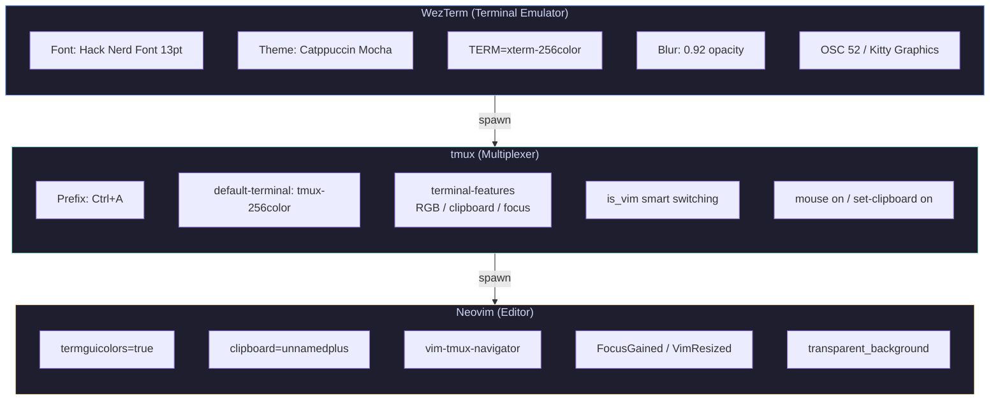
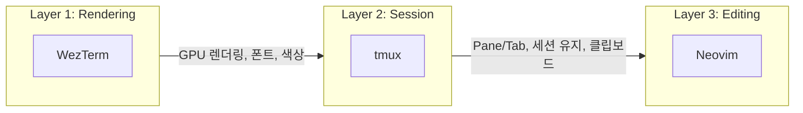
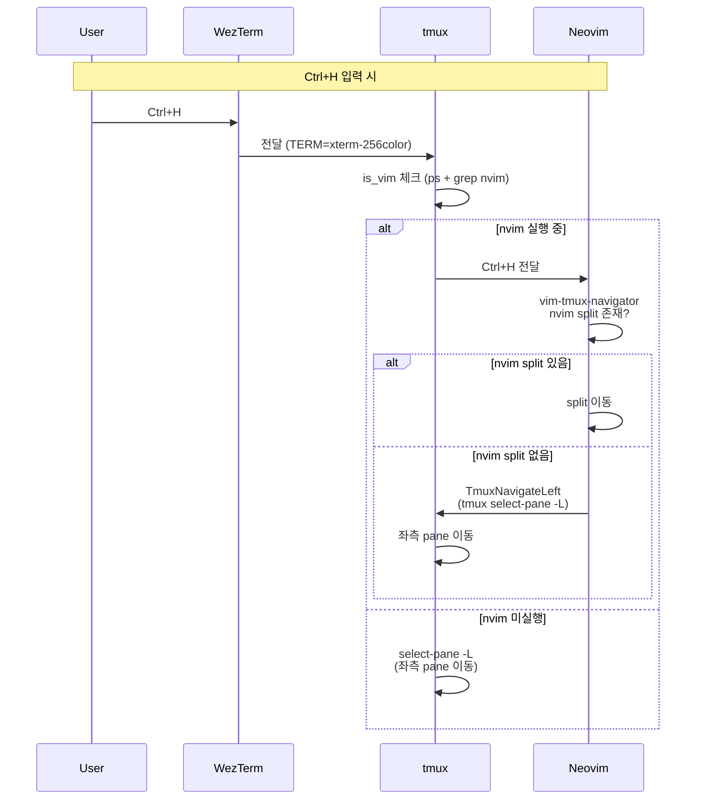
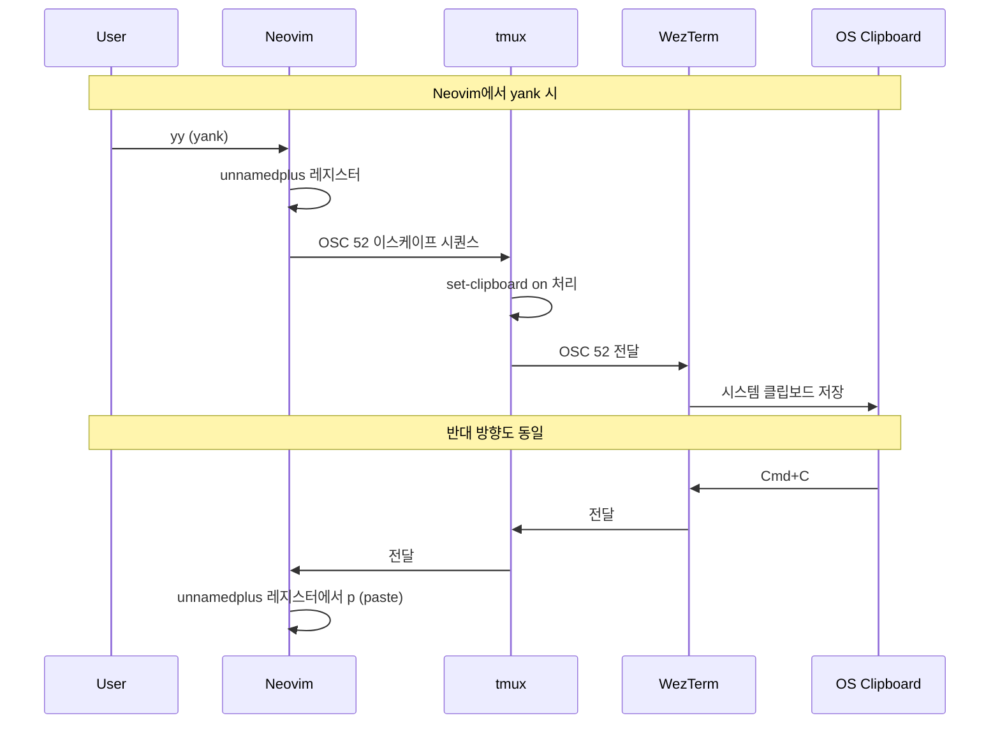
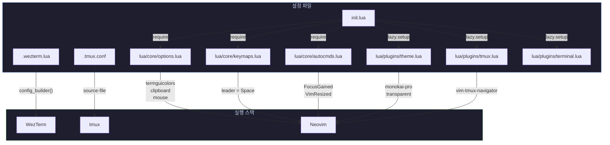
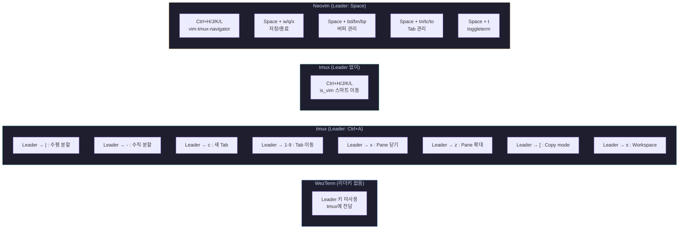
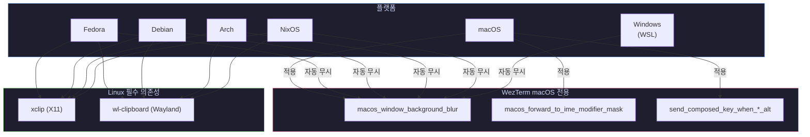
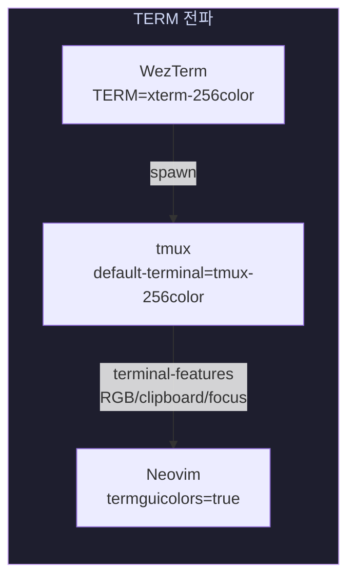

# Desktop Terminal Stack

> WezTerm + tmux + Neovim 통합 환경 문서

## 아키텍처



## 레이어 책임



| 레이어    | 담당          | 비고                                |
|-----------|---------------|-------------------------------------|
| WezTerm   | 렌더링 전담   | 폰트, 테마, 투명도, GPU 가속        |
| tmux      | Multiplexer   | Pane/Tab 분할, 세션 유지, SSH 복구  |
| Neovim    | 편집 전담     | LSP, Treesitter, Plugin 관리        |

## 키 입력 흐름



## 클립보드 흐름



## 설정 파일 맵핑



## 단축키 맵



## 크로스 플랫폼 호환성



| 플랫폼       | WezTerm | tmux | Neovim | 클립보드              | blur  |
|--------------|---------|------|--------|-----------------------|-------|
| macOS        | O       | O    | O      | pbcopy (내장)         | O     |
| Fedora       | O       | O    | O      | xclip / wl-clipboard  | comp  |
| Debian       | O       | O    | O      | xclip / wl-clipboard  | comp  |
| Arch         | O       | O    | O      | xclip / wl-clipboard  | comp  |
| NixOS        | O       | O    | O      | nix config에 추가     | comp  |
| Windows WSL  | O       | O    | O      | WSL clipboard         | X     |

> `comp` = compositor (picom, kwin, mutter 등) 필요

## TERM 설정 체인



> `xterm-256color` 사용 이유: nix 환경에서 `wezterm` terminfo 미설치 시 에러 방지.
> tmux `terminal-features`로 True Color / OSC 52 / Focus event 보완.

## 파일 경로 요약

```
base/
├── .wezterm.lua                          # WezTerm 설정
├── .tmux.conf                            # tmux 설정
└── .config/nvim/
    ├── init.lua                          # Neovim 진입점
    └── lua/
        ├── core/
        │   ├── options.lua               # 기본 옵션 (clipboard, mouse, termguicolors)
        │   ├── keymaps.lua               # 키매핑 (leader=Space)
        │   └── autocmds.lua              # 자동명령 (FocusGained, VimResized)
        └── plugins/
            ├── theme.lua                 # monokai-pro (transparent_background)
            ├── tmux.lua                  # vim-tmux-navigator
            └── terminal.lua              # toggleterm
```
