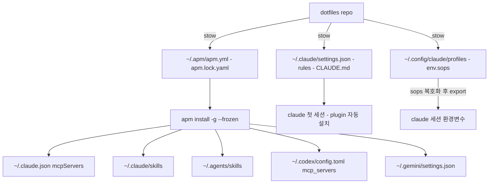

# apm 기반 AI Agent Layer 공통화 설계

> **Date**: 2026-09-27 · **Status**: 승인 완료 — 구현 대기 · **Owner**: crong
> 대상: dotfiles 전 호스트(macOS/Linux) + kyolim(Windows)의 AI agent toolchain 배포

## 목차

- [배경 및 목표](#배경-및-목표)
- [범위](#범위)
- [설계 원칙](#설계-원칙)
- [아키텍처](#아키텍처)
- [상세 설계](#상세-설계)
- [Bootstrap 흐름](#bootstrap-흐름)
- [마이그레이션 계획](#마이그레이션-계획)
- [검증 체크포인트](#검증-체크포인트)
- [운영 규칙](#운영-규칙)
- [리스크 및 미검증 항목](#리스크-및-미검증-항목)
- [Future work](#future-work)

## 배경 및 목표

### 문제

1. **홈 전용 배포 상태**: plugin 39개(`~/.claude/plugins/installed_plugins.json`), skills(`~/.agents/skills/`), MCP user 6개(`~/.claude.json`), Codex MCP 3개(`~/.codex/config.toml`)가 전부 app-managed — repo에 선언이 없어 신규 장비에서 수동·대화형 재설치 필요
2. **관리 체계 이원화**: skills는 vercel skills CLI(`~/.agents/.skill-lock.json`), MCP는 수동 편집 — lock/재현성 없음
3. **평문 시크릿**: `eve/.claude/settings.json`·`settings.zai`에 평문 `ANTHROPIC_AUTH_TOKEN`이 git 추적 중 — sops 규칙 위반

### 목표

- 신규 장비에서 `install.sh`(POSIX) 또는 `windows/install.ps1`(kyolim) 1회 실행으로 plugin·skill·MCP 전체 재현
- `apm install -g --frozen` 기반 lockfile 재현성 확보
- 평문 token 제거 (gitleaks 통과)

## 범위

### In scope

| 항목 | 내용 |
| :--- | :--- |
| 외부 skill 패키지 3종 | microsoft-foundry, convert-documents-to-markdown, find-skills |
| MCP user 6개 | aperture, serena, web-reader, web-search-prime, zai-mcp-server, zread |
| settings 소유권 분리 | `settings.json` stow 고정화 + provider 환경변수 프로파일 전환 |
| skills CLI 폐지 | `~/.agents/.skill-lock.json` 제거, apm으로 일원화 |
| bootstrap 스크립트 | 신규 `install.sh` + `windows/install.ps1` 확장 |

### Out of scope

| 항목 | 사유 |
| :--- | :--- |
| 자체 제작 스킬 2종 (multi-agent-verification, omc-reference) | SoT는 `ai-agent-skill` repo에서 별도 제작 — Future work로 git 패키지 참조 확장 |
| dotfiles local MCP 4개 (context7, exa, filesystem, github) | project scope 검토 시 처리 (`repo .mcp.json` 후보) |
| Codex node_repl MCP | codex 전용, 수동 유지 |
| plugin-bundled MCP (context7, playwright 등) | plugin 설치에 귀속 |
| repo root `apm.yml` (project scope) | 현행 유지 (의존성 비음) |
| walle, ava, pad, arv, steward | agent toolchain 불필요 호스트 |

## 설계 원칙

1. **SoT 기준 계층 분리**: repo가 Source of Truth인 자체 작성 파일은 stow, 외부 패키지가 Source of Truth인 것은 apm이 배포. README "Application Manager 4-Layer"의 Layer 3(apm) 정의와 정합
2. **배포 산출물 디렉토리의 단독 소유**: `~/.claude/skills/`, `~/.agents/skills/` 등 설치로 생성되는 디렉토리는 apm(또는 Claude Code) 단독 소유 — repo/stow 패키지에 포함하지 않는다
3. **dotfiles의 apm은 선언적 관리만**: 의존성 추가·변경은 `apm.yml` 편집으로만. imperative install로 manifest를 변경하는 행위 금지. 제작·패키징은 `ai-agent-skill` repo의 책임
4. **user scope 중심**: 배포 단위는 `~/.apm/apm.yml`(user global). project scope는 후순위

## 아키텍처



| 배포 대상 | 선언 위치 | 실행 주체 |
| :--- | :--- | :--- |
| 외부 skill 3종 | `base/.apm/apm.yml` | apm → 3에이전트 각 위치 |
| MCP 6개 | `base/.apm/apm.yml` (`mcp:`) | apm → `~/.claude.json`, `~/.codex/config.toml`, `~/.gemini/settings.json` |
| rules·CLAUDE.md·AGENTS.md·GEMINI.md·settings | 기존 `base/.claude/` 등 | stow (현행 유지) |
| plugins 39개 | stow된 settings의 `extraKnownMarketplaces` + `enabledPlugins` | Claude Code 런타임 (첫 세션 자동 설치) |
| provider 자격 증명 | `base/.config/claude/profiles/*.env.sops` | shell 로더 → env |

## 상세 설계

### 1. user manifest — `base/.apm/`

```
base/.apm/
├── apm.yml           # user global manifest — stow가 ~/.apm/apm.yml로 symlink
└── apm.lock.yaml     # apm이 rewrite → repo에 반영, commit 추적
```

- `~/.apm/config.json`(apm CLI 설정)은 머신 로컬 — stow 패키지에 미포함
- manifest 개요 (정확한 YAML 키명은 Phase 0에서 확정):

```yaml
name: global-agents
targets: [claude, codex, gemini]
dependencies:
  apm:
    - git: microsoft/azure-skills
    - git: firecrawl/anydoc
    - git: vercel-labs/skills
  mcp:
    - name: zai-mcp-server        # stdio, env는 ${VAR} placeholder만
    - name: aperture              # http
    # ... 하단 매핑 표 참조
```

### 2. settings 소유권 분리

**Before** (문제): live `~/.claude/settings.json`이 profile 교체로 분기된 실파일. `eve/.claude/settings.{zai,kimi,aperture}`에 평문 token 포함.

**After**:

| 파일 | 내용 | 소유 |
| :--- | :--- | :--- |
| `base/.claude/settings.json` | `enabledPlugins` 28개 매트릭스(live 파일 기준 채택) + `extraKnownMarketplaces` 5개 + hooks(OMC) + permissions | stow 고정 |
| `base/.config/claude/profiles/zai.env.sops` | `ANTHROPIC_AUTH_TOKEN`, `ANTHROPIC_BASE_URL` 등 | sops 암호화 |
| `base/.config/claude/profiles/kimi.env.sops` | 동일 구조 | sops 암호화 |
| `base/.config/claude/profiles/aperture.env.sops` | 동일 구조 | sops 암호화 |
| `base/.config/claude/profiles/env.example` | 키 목록 공유 (값 제외) | 평문 |

- 로더: base alias에 shell function 추가 — `sops -d`로 profile env를 export한 뒤 `claude` 실행
- 세션 시작 워크플로우 변경: `claude` 직접 실행 → 프로파일 로더 경유
- `eve/.claude/settings.{zai,kimi,aperture}`는 이관 후 삭제, 평문 token 경로 제거
- 최종 키 배치(`settings.json` vs `settings.local.json`)는 마이그레이션 시 live 파일 병합으로 확정. 원칙: 공통 고정 = `settings.json`, 머신 로컬 예외 = `settings.local.json`

### 3. MCP 매핑

| 서버 | transport | 선언 | 비고 |
| :--- | :--- | :--- | :--- |
| aperture | http | `url: ${APERTURE_MCP_URL}` | Tailscale 내부 URL — sops 관리 |
| web-reader | http | url 리터럴 | 공개 서비스 엔드포인트 |
| web-search-prime | http | url 리터럴 | 동일 |
| zread | http | url 리터럴 | 동일 |
| serena | stdio | `command: serena start-mcp-server ...` | per-agent 인자 차이 Phase 0 확인 |
| zai-mcp-server | stdio | `command: npx -y @z_ai/mcp-server`, env `Z_AI_API_KEY: ${Z_AI_API_KEY}`, `Z_AI_MODE` 리터럴 | |

### 4. skills CLI 폐지

- `~/.agents/.skill-lock.json` 삭제, `npx skills` 사용 중단
- 외부 3종은 apm 재설치로 전환 (`~/.claude/skills`, `~/.agents/skills`의 기존 symlink는 apm 배포가 재작성)
- 자체 제작 실디렉토리 2종(`multi-agent-verification`, `omc-reference`)은 현행 유지 — 삭제·이동 금지

### 5. kyolim (Windows)

- `windows/install.ps1` 확장: `winget install Microsoft.APM` → `base/.apm/apm.yml`을 `%USERPROFILE%\.apm\apm.yml`로 junction (windows 패키지에 복제 두지 않음 — DRY) → `apm install -g --frozen`
- kyolim은 claude 우선. codex/gemini 미설치 시 apm targets 거동을 Phase 0에서 확인, 필요 시 `--target claude` 오버라이드

### 6. secrets

- 신규 sops 관리 키: `Z_AI_API_KEY`, `APERTURE_MCP_URL`, 프로파일 3종의 token/base URL
- 워크플로우는 기존 규칙(`.env.sops` 추적, `.env.example` 키 공유) 준수
- gitleaks로 평문 잔여 검증 (verify 5)

## Bootstrap 흐름

신규 `install.sh` (repo root, `windows/install.ps1`과 대칭):

```bash
./install.sh <host>   # host: eve | axiom | bazzite | girl | auxo
```

1. `stow -t ~ base <host-pkg>` — OS layer + `~/.apm/` manifest + settings + profiles
2. `brew bundle`(eve·axiom·mo — 각 Brewfile에 `apm` 추가) 또는 `curl -sSL https://aka.ms/apm-unix | sh`(girl·auxo — linux-arm64 지원)
3. `eval "$(sops -d ~/.key)"` — secrets export
4. `apm install -g --frozen` — skills + MCP → 3에이전트
5. 첫 claude 세션에서 plugin 자동 설치 (settings 선언 기반)

기존 README Install 섹션을 이 흐름으로 갱신한다.

## 마이그레이션 계획

| Phase | 대상 | 내용 |
| :--- | :--- | :--- |
| 0 | eve (검증) | 리스크 표의 미검증 항목 전수 확인 (`--dry-run` 중심) |
| 1 | eve | live settings.json 매트릭스 채택 → 고정 settings.json 작성, 프로파일 sops 전환, skills CLI 폐지, MCP apm 이관, drift 치유(아래) |
| 2 | axiom, mo, girl, auxo | `install.sh` 실행 기준 순차 적용 |
| 3 | kyolim | `install.ps1` 확장 적용 + `windows/tests/` 케이스 추가 |

Phase 1 drift 치유 항목:

- live `~/.claude/settings.json` 분기 해소 (repo 파일로 stow 연결) — 필수
- `settings.kimi`·`settings.aperture`의 미설치 plugin 참조 — 프로파일 폐지로 자연 해소
- `~/.claude/plugins/cache/` temp debris ~40개 정리 — 선택
- `~/.claude/CLAUDE.md` OMC rewrite 분기 — 선택 (stow 재연결)

## 검증 체크포인트

1. stow 후 → `ls -la ~/.apm/apm.yml`이 symlink인가 → verify: 경로가 repo 파일 가리킴
2. `apm install -g --frozen` 후 → `claude mcp list`·`~/.codex/config.toml`·`~/.gemini/settings.json`에 6개 서버 존재 → verify: 이관 전 후 서버 목록 동일
3. 첫 claude 세션 후 → `claude plugin list --json` → verify: enabledPlugins 28개 매트릭스와 일치
4. `apm audit` → verify: drift/hidden Unicode 경과 없음
5. `gitleaks detect` → verify: 평문 token 검출 0건
6. kyolim → verify: `windows/tests/` 통과

## 운영 규칙

- **의존성 변경은 선언적으로**: `apm.yml` 편집 → `apm install -g` → lock 갱신 → dotfiles commit. imperative install로 manifest 임의 변경 금지
- 외부 패키지 버전 갱신: `apm update` → lock commit
- 정기 점검: `apm audit`·`apm outdated` (drift 조기 발견)
- 자체 스킬 신규 제작은 `ai-agent-skill` repo에서 — dotfiles apm.yml은 완성된 패키지를 참조만

## 리스크 및 미검증 항목

Phase 0(eve)에서 전수 검증한다. 항목별 대응까지 정해 둔다.

| # | 항목 | 리스크 | 검증 방법 | 대응 |
| :--- | :--- | :--- | :--- | :--- |
| 1 | `mcp:` 스키마 키명 (stdio command/args/env) | manifest 작성 불가 | `apm mcp install --help` + dry-run | CLI가 생성한 YAML을 manifest에 채택 |
| 2 | symlink 통한 lock rewrite | atomic rename이 symlink를 실체로 교체할 수 있음 | dry-run 후 `ls -la ~/.apm/` | 교체되면 `install.sh`에 `stow --restow` 루틴 추가 |
| 3 | `~/.claude.json` merge 동작 | 기존 mcpServers 항목 소실 가능 | 백업 후 dry-run + diff | 소실 시 이관 전 수동 항목 제거 후 재배포 |
| 4 | Codex/Gemini MCP write 위치 | 문서 미명시 | 배포 후 실측 | 매핑 표에 실측값 반영 |
| 5 | serena per-agent 인자 (`--context`) | codex/gemini에 부적합 인자 배포 | 배포 후 각 에이전트에서 serena 응답 확인 | 필요 시 per-entry target 지정 또는 수동 유지로 제외 |
| 6 | zai-coding-plugins 로컬 directory 마켓의 선언적 표현 | 신규 장비 자동 설치 불가 | `extraKnownMarketplaces` source type 조사 | 3옵션 택일: ai-agent-skill repo 마켓 이관 / directory source + vendor provisioning / 수동 예외 유지 |
| 7 | plugin 자동 설치의 `enabled: false` 항목 거동 | 미사용 plugin까지 설치될 수 있음 | 첫 세션 후 `claude plugin list --json` | false 항목이 설치되면 해당 marketplace 참조 제거 |
| 8 | kyolim에서 codex/gemini 미설치 시 targets 거동 | install 실패 가능 | kyolim dry-run | `--target claude` 오버라이드 |

## Future work

- 자체 제작 스킬 공통화: `ai-agent-skill` repo에서 패키지 제작 → dotfiles `apm.yml`에 `deuxksy/ai-agent-skill` git-path(`owner/repo/path`, `--ssh` transport)로 참조
- project scope 활용: dotfiles local MCP 4개를 repo `.mcp.json`으로 이관
- `~/.claude/CLAUDE.md` OMC rewrite drift의 구조적 해결
